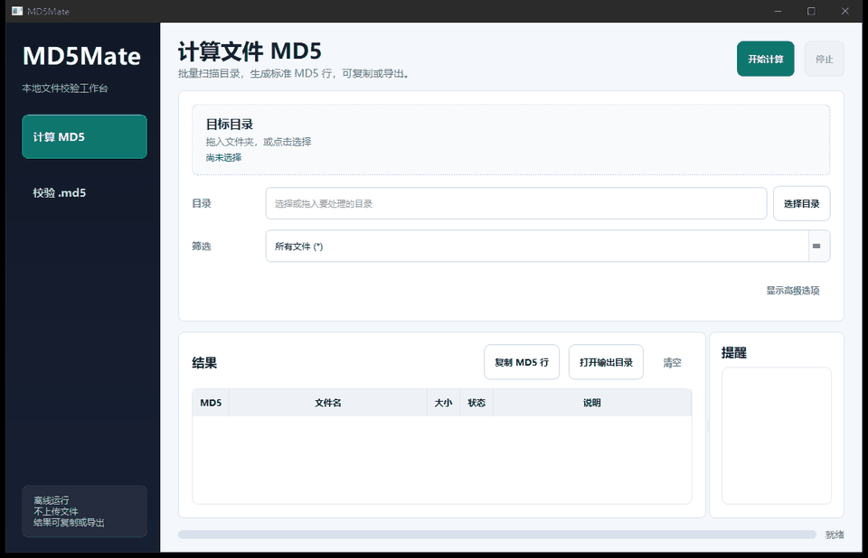

# MD5Mate

MD5Mate 是一个面向 Windows 桌面用户和脚本批处理场景的本地文件 MD5 工具。它支持批量计算、`.md5` 文件校验、可配置线程数、错误提醒、结果复制和标准 md5sum 格式导出，适合校验下载文件、安装包、归档包或资料目录。



## 功能特性

- 现代 Qt 桌面界面，支持目录和 `.md5` 文件拖拽。
- 批量扫描目录并递归计算文件 MD5。
- 支持 `*`、`*.zip`、`.txt,.log`、`txt,log` 等筛选写法。
- 可配置计算线程数，范围 1-64。
- 输出路径可留空；留空时只在界面中展示结果，不生成文件。
- 复制和导出结果时使用标准 md5sum 行格式：`md5  文件名`。
- 支持导入 `.md5` 文件，对所选目录内的文件进行一致性校验。
- 文件级错误不会中断整个任务，失败、缺失和扫描提醒会集中展示。
- 提供 CLI，适合脚本、CI 或批处理任务。

## 运行 GUI

```powershell
python main.py
```

安装为本地包后也可以运行：

```powershell
pip install -e .
md5mate-gui
```

## 命令行用法

```powershell
md5mate "D:\Downloads" --filter ".zip,.exe" --threads 8 --output checksums.md5
```

常用参数：

- `--filter`: 文件筛选规则，默认 `*`。
- `--threads`: 计算线程数，范围 1-64。
- `--output`: 输出文件路径，内容始终为标准 md5sum 行格式。
- `--strict`: 存在失败文件时返回非零退出码。

## GUI 校验模式

在界面中切换到“校验 .md5”，选择目标目录和 `.md5` 文件即可。MD5Mate 支持常见格式：

```text
d41d8cd98f00b204e9800998ecf8427e  file.txt
MD5 (file.txt) = d41d8cd98f00b204e9800998ecf8427e
```

校验结果会标记为“一致 / 不一致 / 缺失 / 错误”。

## 输出格式

导出文件只写入成功文件，格式为 `md5  relative/path`。未填写输出路径时，不生成文件，只在界面里展示结果。

## 开发

```powershell
python -m venv .venv
.\.venv\Scripts\Activate.ps1
pip install -e ".[dev,build]"
pytest
```

发布前可以运行更完整的本地 QA 矩阵：

```powershell
python scripts\qa_matrix.py
```

## 打包

```powershell
python build.py
```

生成文件位于 `dist/MD5Mate.exe`。Qt 版本会比 tkinter 版本体积更大，这是为了换取更成熟的桌面外观和交互体验。

## 开源许可

本项目使用 MIT License。
